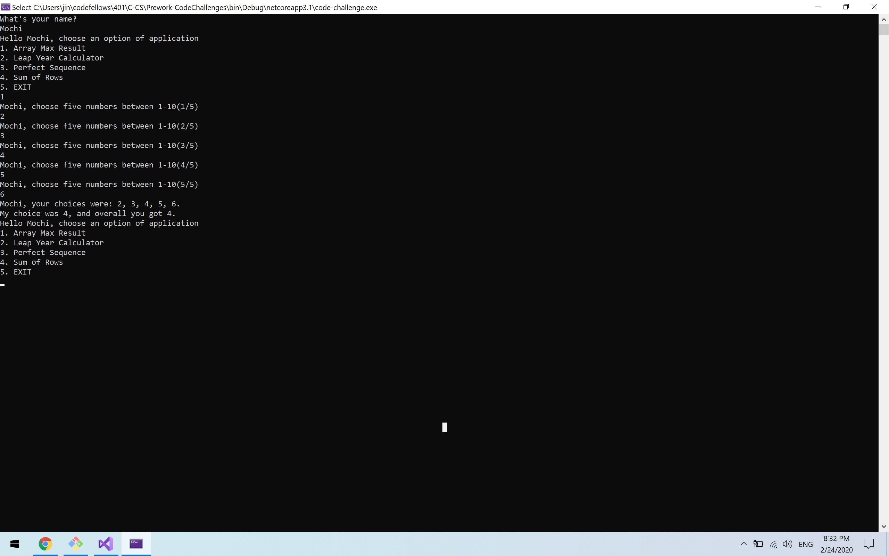

# .NET Prework
MIT based repository that contains Code Fellows 401 pre-work.

Author: Jin Kim

Prework  

## Code-Challenge
### Problem 1: Array Max Result
  
### Instruction of Challenge
Run the application by typing `dotnet run` in the /code-challenge folder. This will prompt main menu. type 1 and enter to open `Array Max Result` application.
Thereafter, type in 5 inputs and follow instruction. Upon entering five numbers console will prompt my number and how many points user earned.

Credit
- DevU
- mmtus
