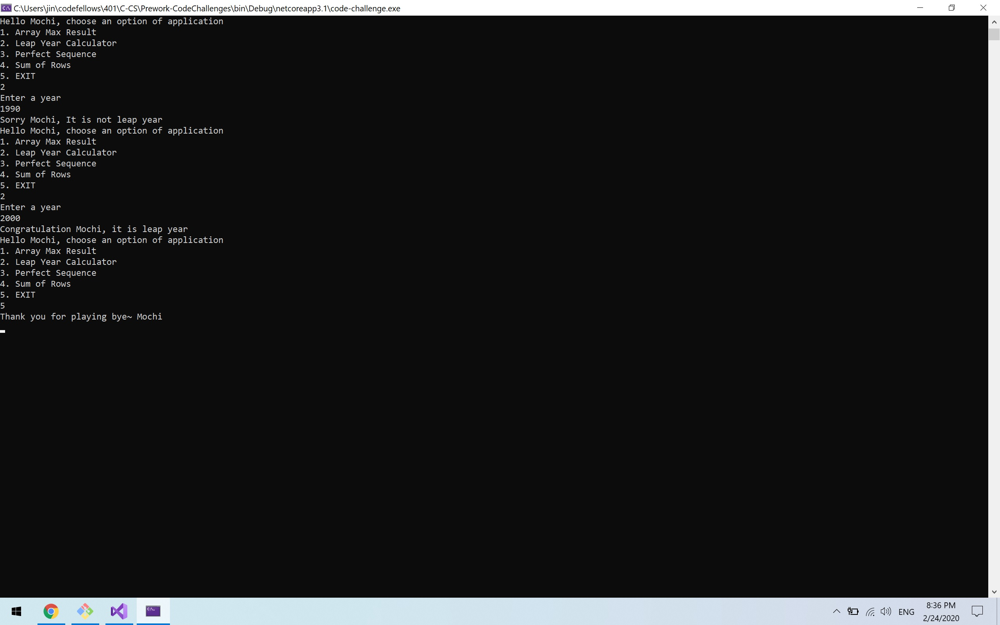

# .NET Prework
MIT based repository that contains Code Fellows 401 pre-work.

Author: Jin Kim

Prework  

## Code-Challenge
### Problem 1: Array Max Result
  
### Instruction of Challenge
Run the application by typing `dotnet run` in the /code-challenge folder. This will prompt main menu. Type in 1 and enter to open `Array Max Result` application.
Thereafter, type in 5 inputs and follow instruction. Upon entering five numbers console will prompt my number and how many points user earned.
  

### Problem 2: Leap Year Calculation

### Instruction of Challenge
Run the application by typing `dotnet run` in the /code-challenge folder. This will prompt main menu. Type in 2 and enter to open `Leap Year Calculation` application.
Thereafter, type in year as seen in instruction. Upon entering the year, console will prompt if it is indeed leap year or not.
  

### Problem 3: Perfect Sequence

### Instruction of Challenge
Run the application by typing `dotnet run` in the /code-challenge folder. This will prompt main menu. Type in 3 and enter to open `Perfect Sequence` application.
Thereafter, type in array of numbers as seen in instruction. Upon entering the array, console will prompt if it is indeed a perfect sequence.
  

Credit
- DevU
- mmtus
